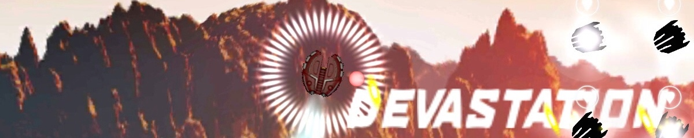
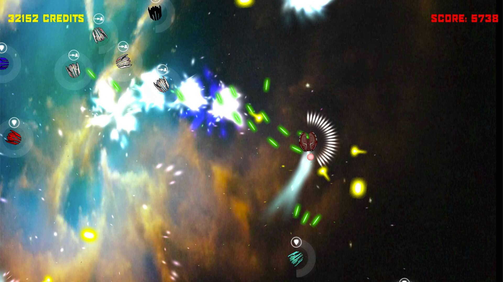
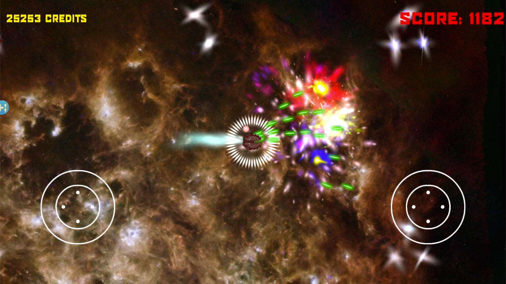
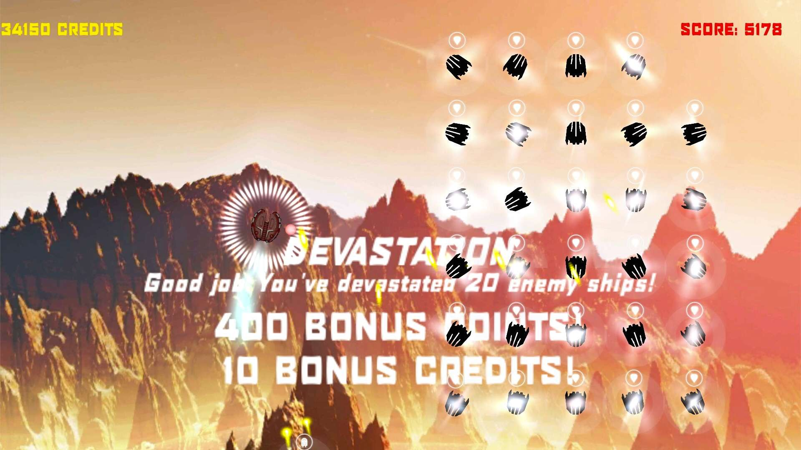
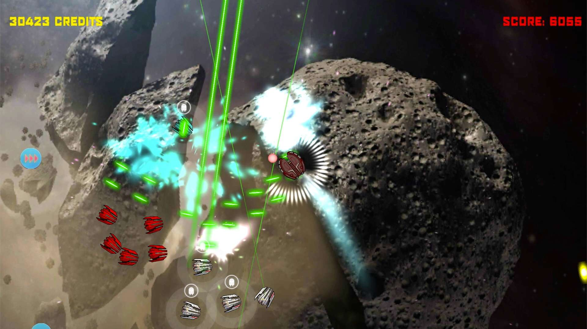
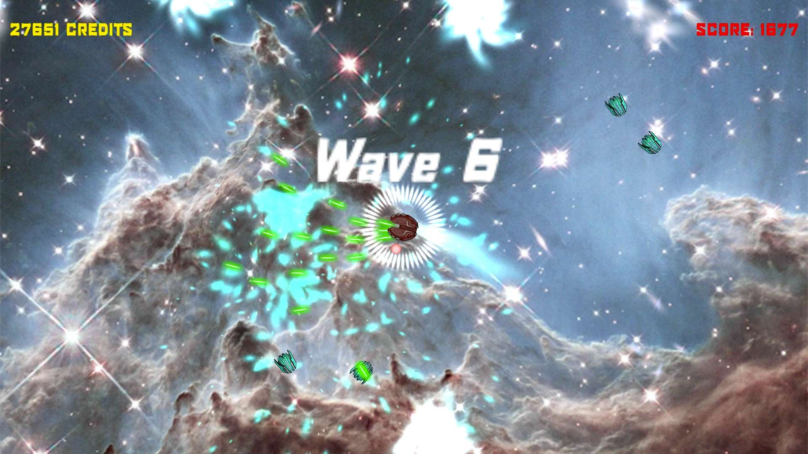
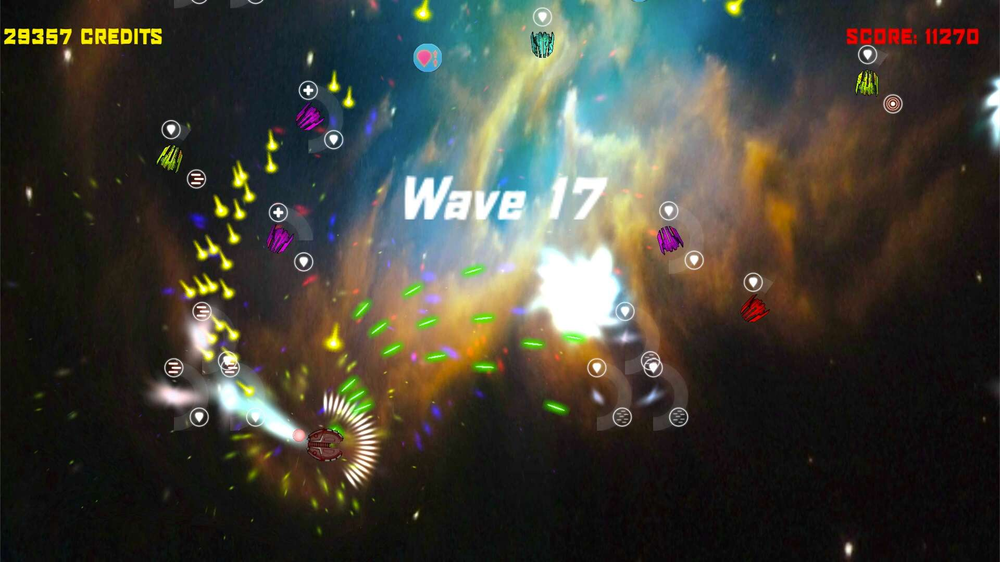
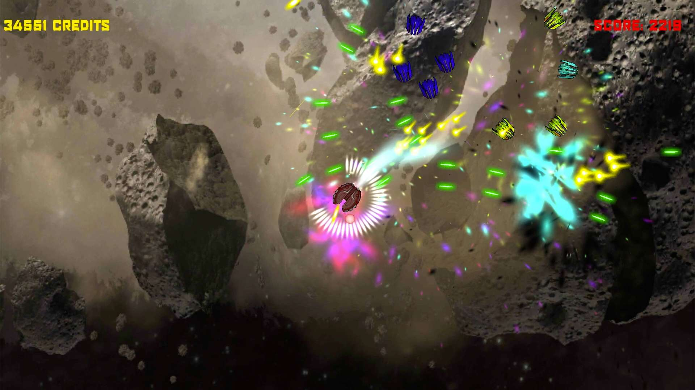
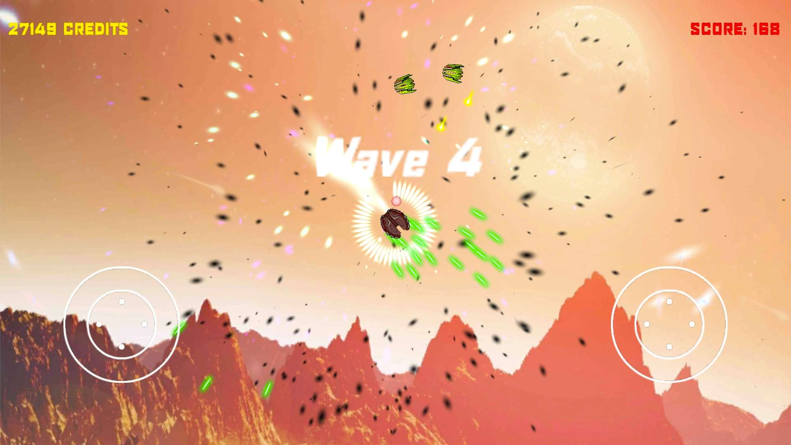
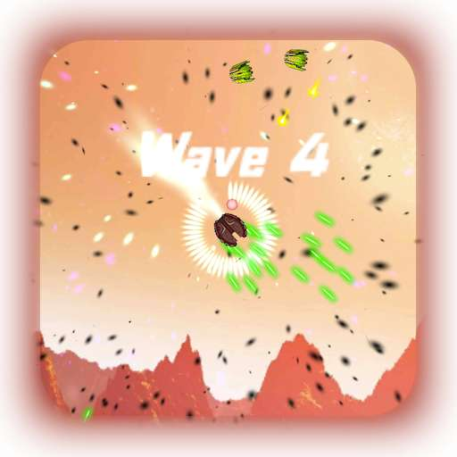

# 

## Factsheet

**Developer:**  
Bartlomiej Mamzer

**Website:**  
[bmamzer.github.io/website][homepage]

**Press / Business contact:**  
[bartlomiejmamzergames@gmail.com][contact]

**Social:**  
[twitter.com/mzrgames][twitter]    
[Skype](callto:bartek010102)

**Releases:**  
Zerdian

## Description

Bartlomiej Mamzer is just one guy, making games in his free time.

## History

Zerdian is Bartlomiej’s first officially released game.
It took quite a while to finish it. Mainly because of the fact that, as a starting developer, Bartlomiej had to learn how to use leaderboards, achievements, cloud save, replays and other cool features that he could find.
During the development the approach changed a few times, the final version could be described as a mix between Geometry Wars, Raptor: Call of the Shadows and Diablo.
The most obvious connection (to Geometry Wars) is the main gameplay and special effects - Zerdian is a twin stick shooter with morphing backgrounds.
Ship upgrade system was influenced by a cool old game called Raptor: Call of the Shadows published by Apogee Software in 1994.
As for Diablo - enemy ship generator that allow foes to have random skills was created bearing in mind elite monsters from Blizzard’s hit game. There was an idea to use a similar item generator, but that will have to wait for a future update, as well as multiplayer.

Zerdian is available on Google Play, although there are plans to release it on iOS and Windows Phone.

## Projects

* Zerdian

## Videos

And here’s the trailer for my first game [Youtube](http://www.youtube.com/watch?v=IYbvSmNIc8I)

<iframe src="//www.youtube.com/embed/IYbvSmNIc8I" frameborder="0" allowfullscreen></iframe>

## Images

download all screenshots & photos as ** [.zip (23 MB)](assets/images/images.zip "Images zip") **

## Icon

download the icon as ** [.zip (323 KB)]( assets/images/icon.zip "Icon zip") **

<!--- =====================================================================  -->
<!--- Referenced links -->

[homepage]: http://bmamzer.github.io/website

[contact]: mailto:bartlomiejmamzergames@gmail.com

<!--- Social -->

[twitter]: https://twitter.com/mzrgames
[skype]: bartek010102